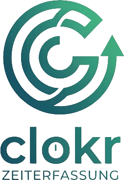

<p align="center">
  
</p>

<p align="center"><strong>Open-source time tracking & workforce management for small businesses.</strong></p>

Clokr is a self-hosted web application for tracking working hours, managing leave requests, and handling overtime — built for teams that need a simple but complete solution without a SaaS subscription.

---

## Features

- **Time Tracking** — Clock in/out, manual entries, monthly calendar view, one entry per day with multiple breaks, ArbZG compliance checks
- **Leave Management** — Vacation, sick leave, maternity/parental leave, overtime compensation; approval workflow with cancellation flow
- **Overtime Account** — Snapshot-based balance tracking with monthly closing (Monatsabschluss), yearly carry-over (configurable: FULL/CAPPED/RESET), configurable thresholds and payout support
- **Monatsabschluss** — Automatic monthly closing with completeness check, sequential validation, manager notifications for missing entries, admin overview with status filter
- **Shift Planning** — Weekly grid view, templates, quick-assign mode for admins/managers
- **Employee Management** — Invite-based or direct creation with password, role management, bulk CSV import, DSGVO-compliant anonymization on deletion
- **Manager Corrections** — Managers can edit and revalidate employee time entries
- **Reports** — Monthly summaries, leave overview, PDF export, DATEV CSV export
- **Audit-Proof (Revisionssicher)** — Soft delete, full audit trail (who/when/what/why), isLocked enforcement after month close, data retention with configurable retention periods (default 10 years)
- **Notifications** — In-app notification bell with real-time updates on leave approvals/requests, auto-close reminders
- **iCal Export** — Personal and team absence calendars for integration with external tools
- **2FA** — Optional email OTP for all users
- **Password Reset** — Self-service via email link
- **Themes** — 4 built-in color themes (Pflaume, Nacht, Wald, Schiefer), switchable per user
- **Timezone Support** — Configurable per tenant, handles DST correctly
- **Self-hosted** — Full Docker Compose deployment, bring your own SMTP

---

## Tech Stack

| Layer    | Technology                                  |
| -------- | ------------------------------------------- |
| Frontend | SvelteKit + Svelte 5, TypeScript            |
| Backend  | Fastify 5, TypeScript                       |
| Database | PostgreSQL 18 + Prisma 7                    |
| Cache    | Redis 7                                     |
| Storage  | MinIO (S3-compatible)                       |
| Auth     | JWT (Access + Refresh) + optional Email OTP |
| Monorepo | pnpm workspaces                             |

---

## Quick Start (no source code needed)

```bash
# 1. Download compose file and env template
curl -fsSLO https://raw.githubusercontent.com/the operatorZ84/clokr/main/docker-compose.prod.yml
curl -fsSLO https://raw.githubusercontent.com/the operatorZ84/clokr/main/.env.example
cp .env.example .env

# 2. Generate secrets and edit .env
node -e "console.log(require('crypto').randomBytes(32).toString('hex'))"
# Copy the output into JWT_SECRET, JWT_REFRESH_SECRET, ENCRYPTION_KEY
nano .env

# 3. Start
docker compose -f docker-compose.prod.yml up -d
```

**Open `http://localhost:3000`** — first start seeds a demo admin account.

### Updates

```bash
docker compose -f docker-compose.prod.yml pull
docker compose -f docker-compose.prod.yml up -d
```

### Pin a version

Set `CLOKR_VERSION=3.1.1` in `.env` to pin to a specific release.

---

## NFC Desktop Client

For NFC-based time tracking with a USB smart card reader (e.g., SCM uTrust 3700 F):

**Download** the latest client from the [Releases page](https://github.com/the operatorZ84/clokr/releases):

- **macOS**: `clokr-nfc-*.dmg`
- **Windows**: `clokr-nfc-*.msi`

The client runs in the system tray, reads NFC cards via PC/SC, and sends clock-in/out requests to your Clokr server. Works offline — queued punches sync automatically when the connection is restored.

---

## Deployment from Source

For development or custom builds.

### 1. Clone

```bash
git clone https://github.com/the operatorZ84/clokr.git
cd clokr
```

### 2. Configure

```bash
cp .env.example .env
nano .env  # Set POSTGRES_PASSWORD, JWT_SECRET, ENCRYPTION_KEY
```

### 3. Start

```bash
docker compose up --build -d
```

| Service      | Port      | Description                      |
| ------------ | --------- | -------------------------------- |
| **web**      | 3000      | SvelteKit frontend (proxies API) |
| **api**      | 4000      | Fastify backend                  |
| **postgres** | 5432      | PostgreSQL 18                    |
| **redis**    | 6379      | Redis 7                          |
| **minio**    | 9000/9001 | MinIO object storage             |

### 4. Updates

```bash
git pull
docker compose up --build -d
```

The API entrypoint auto-migrates the database on startup.

---

## Local Development

### Prerequisites

- Node.js 24+
- pnpm 10+

### Setup

```bash
pnpm install

# Start infrastructure only
docker compose up postgres redis minio -d

# Copy env and adjust if needed
cp .env.example .env

# Generate Prisma client + push schema
pnpm --filter @clokr/db generate
pnpm --filter @clokr/db db:push

# Seed demo data
pnpm --filter @clokr/db seed

# Start dev servers (hot reload)
pnpm dev
```

- Frontend: http://localhost:5173
- API: http://localhost:4000
- Swagger: http://localhost:4000/docs

---

## Demo Credentials

After seeding:

| Role     | Email          | Password        |
| -------- | -------------- | --------------- |
| Admin    | admin@clokr.de | admin1234       |
| Employee | max@clokr.de   | mitarbeiter5678 |

---

## Project Structure

```
clokr/
├── apps/
│   ├── api/          # Fastify backend
│   └── web/          # SvelteKit frontend
├── packages/
│   ├── db/           # Prisma schema + client
│   ├── mcp/          # MCP server (Claude Code integration)
│   └── types/        # Shared TypeScript types
├── docker-compose.yml
├── .mcp.json         # MCP server config for Claude Code
└── .env.example
```

---

## Roles

| Role       | Permissions                                                         |
| ---------- | ------------------------------------------------------------------- |
| `ADMIN`    | Full access: employees, system settings, audit log, shifts, imports |
| `MANAGER`  | Approve leave, view reports, manage shifts                          |
| `EMPLOYEE` | Own time entries, leave requests, overtime view                     |

---

## API

Swagger UI available at `/docs` when the API is running. Key endpoints:

- `POST /api/v1/auth/login` — Login
- `GET /api/v1/dashboard` — Dashboard stats
- `GET/POST /api/v1/time-entries` — Time tracking
- `GET/POST /api/v1/leave/requests` — Leave management
- `GET /api/v1/reports/monthly` — Monthly report
- `GET /api/v1/shifts/week` — Shift planning
- `POST /api/v1/imports/employees` — Bulk CSV import

---

## MCP Server (Claude Code)

Clokr includes an MCP server for Claude Code integration. After `pnpm install`, it auto-registers via `.mcp.json`. Available tools:

`login`, `dashboard`, `list_employees`, `list_time_entries`, `clock_in`, `clock_out`, `list_shifts`, `list_leave_requests`, `monthly_report`, `overtime_account`, `notifications`, `api_request`

---

## Contributing

PRs welcome. Please open an issue first for larger changes.

---

## License

MIT
